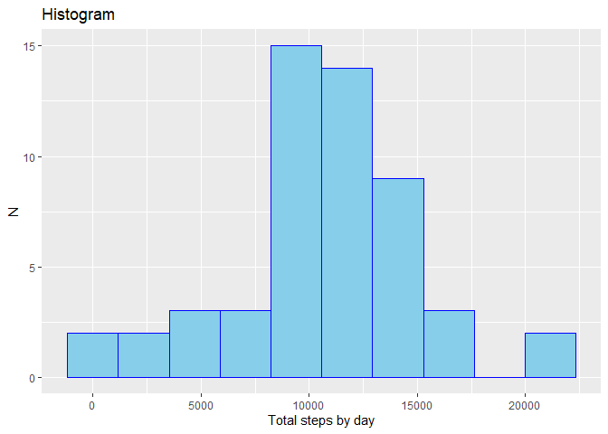
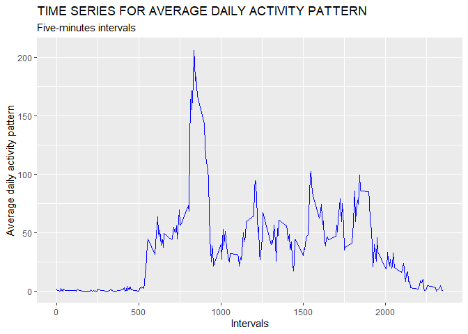
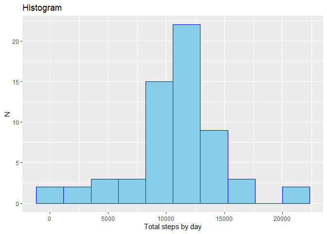
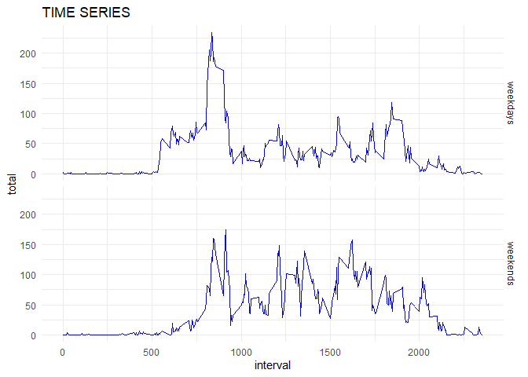

## Loading and preprocessing the data

```r
library(tidyverse)
```

```
## Warning: package 'ggplot2' was built under R version 4.0.2
```

```
## Warning: package 'tidyr' was built under R version 4.0.2
```

```r
data<-read_csv('activity.csv')
```


## What is mean total number of steps taken per day?

```r
data_total_day<-data %>% 
    na.omit %>% 
    group_by(date) %>% 
    summarise(Total=sum(steps))
```

```
## `summarise()` ungrouping output (override with `.groups` argument)
```

```r
data_total_day %>% head(10) %>% knitr::kable()
```


|date       | Total|
|:----------|-----:|
|2012-10-02 |   126|
|2012-10-03 | 11352|
|2012-10-04 | 12116|
|2012-10-05 | 13294|
|2012-10-06 | 15420|
|2012-10-07 | 11015|
|2012-10-09 | 12811|
|2012-10-10 |  9900|
|2012-10-11 | 10304|
|2012-10-12 | 17382|

```r
ggplot(data_total_day,aes(x=Total))+
    geom_histogram(bins = 10,fill='skyblue',col='blue')+
    labs(title = 'Histogram')+
    xlab('Total steps by day')+
    ylab('N')
```

<!-- -->

```r
data_total_day %>% 
    summarise(Mean=mean(Total),Median=median(Total)) %>% 
    knitr::kable()
```


|     Mean| Median|
|--------:|------:|
| 10766.19|  10765|
    


## What is the average daily activity pattern?

```r
data_interval<-data %>% 
    na.omit %>% 
    group_by(interval) %>% 
    summarise(Mean=mean(steps))
```

```
## `summarise()` ungrouping output (override with `.groups` argument)
```

```r
data_interval %>% ggplot(aes(x=interval,y=Mean))+
    geom_line(col='blue')+
    labs(title='TIME SERIES FOR AVERAGE DAILY ACTIVITY PATTERN',
         subtitle='Five-minutes intervals')+
    xlab('Intervals')+
    ylab('Average daily activity pattern')
```

<!-- -->

```r
data_interval %>% summarise(interval=interval[which.max(Mean)]) %>% knitr::kable()
```


| interval|
|--------:|
|      835|


## Imputing missing values

```r
paste('There are',sum(is.na(data)), 'missing values')
```

```
## [1] "There are 2304 missing values"
```
The strategy is replace the nas value for the average of their corresponding interval( i.e if the interval for Na is 5 then this is replace for the mean of interval 5)

```r
data_2=data
data_interval<-data %>% 
    na.omit %>% 
    group_by(interval) %>% 
    summarise(Mean=mean(steps,na.rm=TRUE))
```

```
## `summarise()` ungrouping output (override with `.groups` argument)
```

```r
for(i in 1:nrow(data)){
    if(is.na(data[i,1])==TRUE){
    for(j in 1:nrow(data_interval)){
         if(data[i,3]==data_interval[j,1]){
             data_2[i,1]=data_interval[j,2]
         }
     }}}
head(data_2) %>% knitr::kable()
```


|     steps|date       | interval|
|---------:|:----------|--------:|
| 1.7169811|2012-10-01 |        0|
| 0.3396226|2012-10-01 |        5|
| 0.1320755|2012-10-01 |       10|
| 0.1509434|2012-10-01 |       15|
| 0.0754717|2012-10-01 |       20|
| 2.0943396|2012-10-01 |       25|


```r
data_total<-data_2 %>% 
    group_by(date) %>% 
    summarise(Total=sum(steps))
```

```
## `summarise()` ungrouping output (override with `.groups` argument)
```

```r
ggplot(data_total,aes(x=Total))+
    geom_histogram(bins = 10,fill='skyblue',col='blue')+
    labs(title = 'Histogram')+
    xlab('Total steps by day')+
    ylab('N')
```

<!-- -->

```r
data_total %>% 
    summarise(Mean=mean(Total),Median=median(Total)) %>% 
    knitr::kable()
```


|     Mean|   Median|
|--------:|--------:|
| 10766.19| 10766.19|


## Are there differences in activity patterns between weekdays and weekends?

```r
data_wk<-data %>% 
    mutate(day=format(date,'%A'))
data_wk_1=data_wk %>% 
    mutate(Factor=ifelse(data_wk$day %in%c('sábado','domingo'),
                         'weekends','weekdays'))
data_wk_1 %>% head() %>% knitr::kable()
```


| steps|date       | interval|day   |Factor   |
|-----:|:----------|--------:|:-----|:--------|
|    NA|2012-10-01 |        0|lunes |weekdays |
|    NA|2012-10-01 |        5|lunes |weekdays |
|    NA|2012-10-01 |       10|lunes |weekdays |
|    NA|2012-10-01 |       15|lunes |weekdays |
|    NA|2012-10-01 |       20|lunes |weekdays |
|    NA|2012-10-01 |       25|lunes |weekdays |

```r
data_wk_2<-data_wk_1 %>% group_by(interval,Factor) %>% 
    summarise(total=mean(steps,na.rm=TRUE))
```

```
## `summarise()` regrouping output by 'interval' (override with `.groups` argument)
```

```r
ggplot(data_wk_2,aes(x=interval,y=total))+
    geom_line(col='blue')+
    theme_minimal()+
    facet_grid(vars(Factor))+
    labs(title='TIME SERIES')
```

<!-- -->

